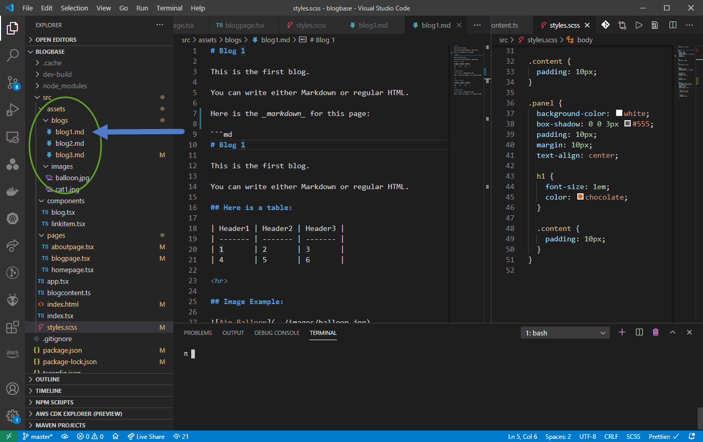

# Blog 3

<div class="panel">
  How do we add new blogs?
  <hr>
  
  <hr>
  <a href="/">Home</a>
  <a href="blog1">Blog1</a>
  <a href="blog2">Blog2</a>
  <a href="blog3">Blog3</a>
  <a href="/about">About</a>
</div>

### Blog Contents (meta data):

Add your blog entries here, but please remember that you have to provide actual blog under the **assets/blogs** folder.

```ts
export const blogContents: IBlogContent[] = [
  {
    id: "blog1",  <- This corresponds to the blog page (i.e. assets/blogs/blog1.md)
    title: "Blog 1",
    summary: "This is the first blog!",
    keywords: "key1, key2",
  },
  {
    id: "blog2",
    title: "Blog 2",
    summary: "This is the 2nd blog!",
    keywords: "key3",
  },
  {
    id: "blog3",
    title: "Blog 3",
    summary: "This is the 3nd blog!",
    keywords: "key4, key5, key6",
  },
]
```

### Technologies Used:

- React
- React router
- Showdown (for markdown)
- Sass (scss)
- Typescript
- ParcelJS (zero config web application bundler)
